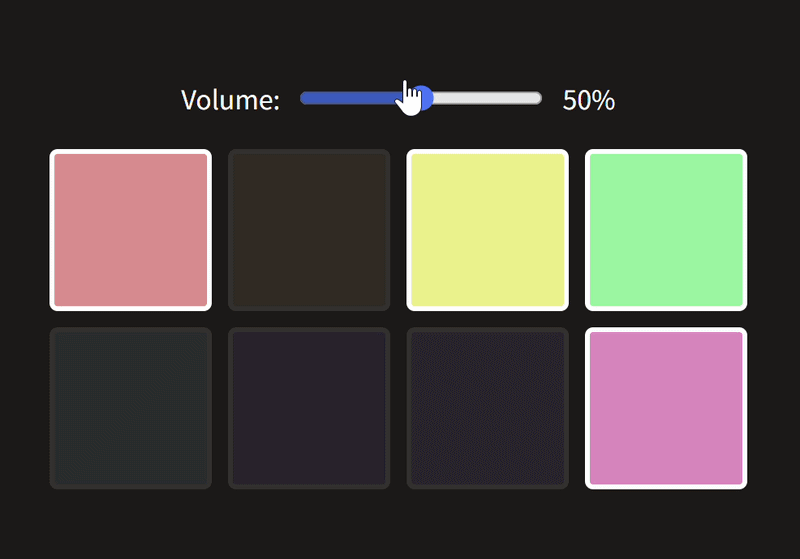

# Sound Pads

An interactive soundboard web app — an 8-pad grid of colourful buttons that play meme sound effects. Built with React 19 and Vite.

[](./media/demo-video.mp4)

## ▶️ Live Demo

<a href="https://gotham-citizen.github.io/Sound-Pads/">
  
</a>

Click the image above or [here](https://gotham-citizen.github.io/Sound-Pads/) to try it!

## Features

- **8 interactive pads** in a 4x2 CSS Grid layout, each with a unique colour and sound
- **Click to toggle** — click a pad to play/stop its sound
- **Keyboard shortcuts** — press keys `1`–`8` to toggle pads (when not focused on an input)
- **Visual feedback** — pads glow at full opacity when active, dim when off
- **Global volume slider** — adjust playback volume (0–100%, default 50%)
- **Volume keyboard controls** — Arrow keys increment/decrement volume by 5%

## Tech Stack

| Technology | Version |
|---|---|
| React | 19.2.7 |
| Vite | 8.1.1 |
| CSS Grid + Flexbox | — |
| HTML5 Audio | — |

## Project Structure

```
Sound Pads/
├── components/
│   └── Pad.jsx              # Individual sound pad component
├── src/
│   ├── App.jsx              # Main app component (state, keyboard handling)
│   ├── Index.jsx            # React entry point (mounts to #root)
│   └── pads.js              # Pad configuration (colours, sounds, keys)
├── styles/
│   └── Index.css            # Global styles (dark theme, grid layout)
├── public/
│   └── sounds/              # 8 MP3 sound effect files
│       ├── amaterasu.mp3
│       ├── dexter-meme.mp3
│       ├── fahhhhhhhhhhhhhh.mp3
│       ├── jojos-bizarre-adventure-ay-ay-ay-ay-_-sound-effect.mp3
│       ├── loading-lost-connection-green-screen-with-sound-effect-2_K8HORkT.mp3
│       ├── oh-no_7.mp3
│       ├── okachan.mp3
│       └── spiderman-meme-song.mp3
├── media/
│   └── demo-video.mp4
│   └── demo.gif
│   └── demo.png
├── Index.html               # HTML shell
├── vite.config.js           # Vite configuration
├── eslint.config.js         # ESLint flat config
└── package.json             # Project metadata & scripts
```

## Getting Started

### Prerequisites

- Node.js (v18 or later)
- npm

### Installation

```bash
npm install
```

### Development

```bash
npm run dev
```

Opens at `http://localhost:5173` by default.

### Build & Preview

```bash
npm run build
npm run preview
```

### Lint

```bash
npm run lint
```

## Usage

| Action | Method |
|---|---|
| Toggle pad on/off | Click a pad button |
| Toggle pad via keyboard | Press `1`–`8` |
| Adjust volume | Drag the slider |
| Increase volume | Arrow Right / Arrow Up |
| Decrease volume | Arrow Left / Arrow Down |

## Configuration

Edit `src/pads.js` to customise pads. Each pad object has these properties:

| Property | Type | Description |
|---|---|---|
| `id` | `number` | Unique identifier (1–8) |
| `color` | `string` | Hex colour code |
| `on` | `boolean` | Initial state (always `false`) |
| `sound` | `string` | Path to MP3 file in `/sounds/` |
| `key` | `string` | Keyboard digit for triggering |